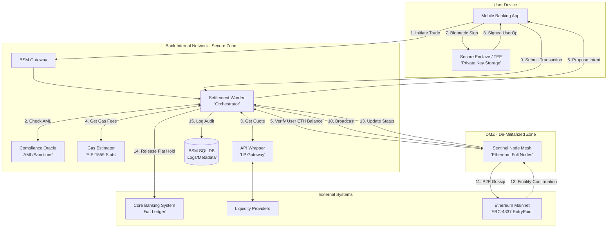

# High-Level Design Document: Blockchain Settlement Module (BSM) v4.0 (Self-Funded Model)

**To:** Executive Steering Committee, CISO, Lead Systems Architect

**From:** Solutions Architecture Office

**Date:** January 22, 2026

**Status:** Final Draft - Self-Funded Gas Architecture

---

## 1. Executive Summary

The **BSM v4.0** is an evolution of the bank’s Ethereum bridge, specifically designed for a **Self-Funded, Non-Custodial** model. Unlike previous iterations, this design shifts the responsibility of network fees (Gas) entirely to the user. The bank acts strictly as an execution orchestrator and liquidity gateway. This approach further reduces the bank's operational complexity and financial exposure to fluctuating Ethereum gas prices, while maintaining a strict "Zero-Access" policy regarding customer private keys.

---

## 2. Logical Architecture

The architecture utilizes a decentralized fee model where the user's **Smart Contract Wallet (SCW)** must be pre-funded with ETH to interact with the **EntryPoint** contract.

### BSM v4.0 Interaction Diagram
This diagram illustrates the non-custodial flow where the bank orchestrates the transaction, but the user provides the cryptographic signature and the funds for the network fees (Gas).


### Key Interaction Details

* **Non-Custodial Trigger:** Note that the **Private Key** never leaves the **TEE**. The Bank (Warden) only handles the "Intent" and the final "Signed UserOp."
* **Self-Funded Gas Check:** In step 5, the Warden queries the **Sentinel Node Mesh** to ensure the user's on-chain address has enough ETH. If not, the process halts before step 6 to prevent failed transaction costs.
* **Decoupled Fiat Settlement:** The **Core Banking System (CBS)** interaction (step 14) only occurs after the **Sentinel Mesh** confirms "Epoch Finality" (12.8 minutes), ensuring the bank never pays out fiat for a blockchain transaction that could be "undone" by a network re-organization.
* **Standardized LP Access:** The **API Wrapper** abstracts the various proprietary APIs of Liquidity Providers, allowing the Warden to treat all LPs as a single standardized interface.

### 2.1 Communication & Network Layer

| Segment | Protocol | Security Standard |
| --- | --- | --- |
| **User Mobile  BSM** | HTTPS/WebSockets | TLS 1.3 + Device Binding + Biometrics |
| **Internal Microservices** | gRPC | Mutual TLS (mTLS) with Istio Service Mesh |
| **Sentinel Mesh  P2P Network** | DevP2P / Libp2p | State-Expiry enabled nodes in DMZ |

---

## 3. Micro-service Descriptions

### 3.1 Settlement Warden (Orchestrator)

The Warden remains the central logic engine. However, its workflow now includes a **Gas Sufficiency Check**. Before proposing a trade, it queries the **Sentinel Mesh** to ensure the user’s SCW has enough ETH to cover the estimated `maxFeePerGas`. It orchestrates the flow from the Liquidity Provider (LP) quote to the final on-chain settlement.

### 3.2 Gas Estimator (Formerly Gas Manager)

Renamed to reflect its new, narrower scope. Since the bank is no longer a "Paymaster," this service no longer funds on-chain contracts. Instead, it pulls high-fidelity data from the `eth_feeHistory` RPC method to provide the user with a "Slow, Medium, or Fast" gas price choice. It monitors the mempool for stalled transactions to advise the user if a "Speed Up" (Replace-By-Fee) is required.

### 3.3 Compliance Oracle

Performs real-time **AML (Anti-Money Laundering)** screening. It ensures that the user is not sending funds to sanctioned addresses. If the Oracle returns a "Fail" status, the Warden will refuse to generate the transaction intent, stopping the process before the user even sees a signature request.

### 3.4 API Wrapper (LP Gateway)

Standardizes the interface to external **Liquidity Providers**. It handles the **RFQ (Request for Quote)** process. Because the bank does not sponsor gas, the LP quotes are "clean," representing only the asset swap price without bundled fee adjustments.

### 3.5 Sentinel Node Mesh

A cluster of Ethereum Full Nodes in the bank's **DMZ**. These nodes serve as the bank's private window into the blockchain, providing real-time data on gas prices, account balances, and **Epoch Finality** (confirmation that the transaction is permanent).

---

## 4. Risks and Benefits

### 4.1 Benefits

* **Reduced Financial Risk:** The bank is not exposed to "Gas Spikes." If the network is congested, the cost is borne by the user, protecting the bank’s fiat margins.
* **Simplified Accounting:** Eliminates the need for complex fiat-to-ETH gas reconciliation and Paymaster re-funding logic.
* **Pure Non-Custodial Model:** The user is fully responsible for their account's "fuel," aligning with the ethos of decentralized finance (DeFi).

### 4.2 Risks

* **User Friction:** Customers must understand that they need ETH in their wallet before they can trade other assets. This increases the "barrier to entry" for crypto-novices.
* **Abandoned Transactions:** If a user’s gas balance is insufficient, the transaction will fail at the **EntryPoint** contract level, potentially leading to support calls.

---

## 5. Implementation Pseudo-Code: Self-Funded Buy Flow

This logic confirms the user has their own "fuel" (Gas) before proceeding.

```python
# BSM Warden v4.0 - Self-Funded Orchestration
def execute_self_funded_trade(user_id, trade_intent):
    # 1. Compliance and Quote
    if not compliance_oracle.verify_user(user_id):
        raise SecurityException("Compliance Block")
    
    quote = api_wrapper.get_quote(trade_intent)

    # 2. Gas Estimation (EIP-1559)
    # Pull current base fee + priority fee suggestions
    gas_stats = gas_estimator.get_fees(speed="standard")
    estimated_cost_eth = calculate_gas_limit() * gas_stats.max_fee

    # 3. On-Chain Balance Check
    # Ensure User SCW has enough ETH for the network fee
    user_scw_address = db.get_user_mapping(user_id)
    on_chain_balance = sentinel_mesh.get_eth_balance(user_scw_address)

    if on_chain_balance < estimated_cost_eth:
        return error("Insufficient ETH for Gas. Please top up your wallet.")

    # 4. Construct UserOperation (Without Paymaster)
    user_op = {
        "sender": user_scw_address,
        "nonce": sentinel_mesh.get_nonce(user_scw_address),
        "callData": encode_trade(quote),
        "maxFeePerGas": gas_stats.max_fee,
        "maxPriorityFeePerGas": gas_stats.priority_fee,
        "signature": None # To be filled by user device
    }

    # 5. Push to User Device for Biometric Signature
    # User signs with the key in their Secure Enclave (TEE)
    signed_op = mobile_service.request_sign(user_id, user_op)

    # 6. Broadcast and Monitor
    tx_hash = sentinel_mesh.broadcast(signed_op)
    sentinel_mesh.wait_for_finality(tx_hash)

```

---

## 6. Assumptions & Technical Standards

1. **ERC-4337 Compatibility:** The user's Smart Contract Wallet must support the standard EntryPoint execution without a Paymaster.
2. **User Education:** The Bank's UI must clearly display the estimated ETH gas fee in fiat terms so the user understands their out-of-pocket cost.
3. **Finality:** The bank maintains the **2-Epoch (12.8 minute)** rule for finalizing fiat-side credits/debits.

---

## 7. Glossary and References

* **AML:** Anti-Money Laundering.
* **EIP-1559:** The Ethereum standard that introduced "Base" and "Priority" fees.
* **EPC:** EntryPoint Contract (The singleton contract that executes ERC-4337 transactions).
* **SCW:** Smart Contract Wallet.
* **TEE:** Trusted Execution Environment.

**References:**

1. [Ethereum Foundation: Gas and Fees](https://ethereum.org/en/developers/docs/gas/)
2. [ERC-4337: Account Abstraction Standard](https://eips.ethereum.org/EIPS/eip-4337)
3. [NIST SP 800-204B: Attribute-based Access Control for Microservices](https://csrc.nist.gov/publications/detail/sp/800-204b/final)
4. [EIP-1559: Fee market change for ETH 1.0 chain](https://eips.ethereum.org/EIPS/eip-1559)


